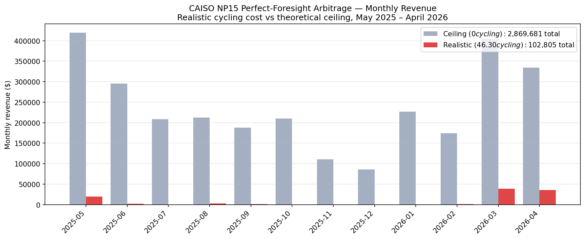
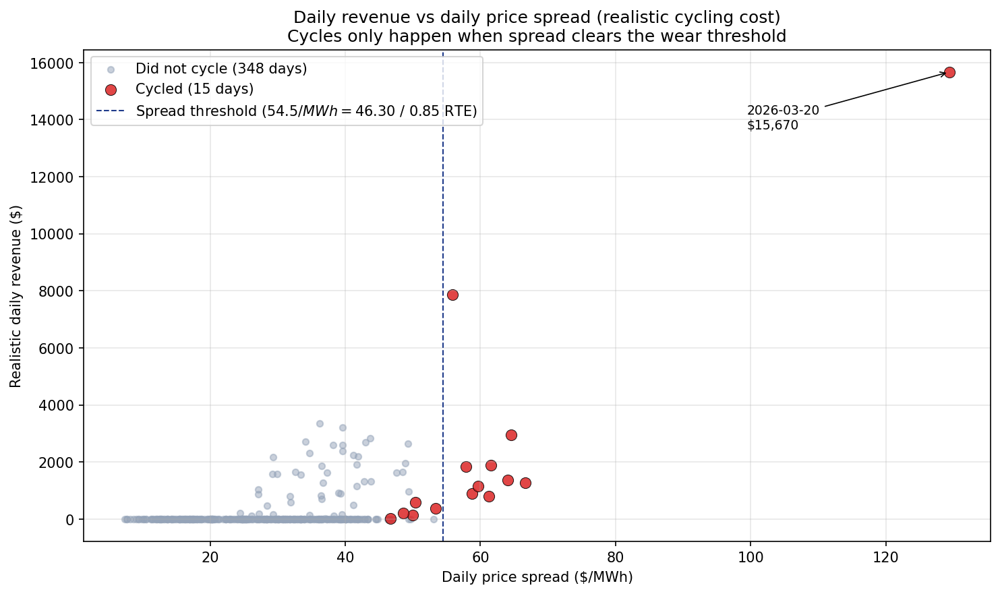
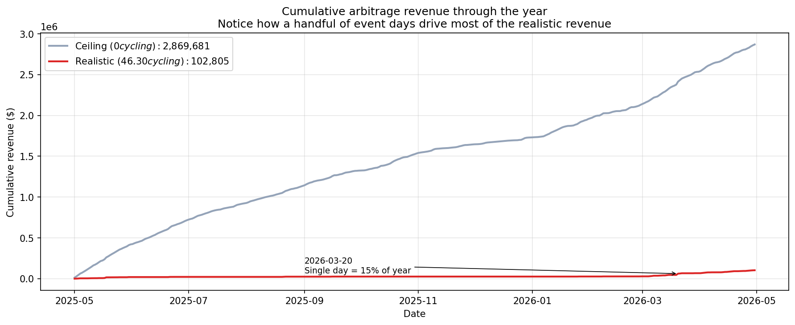

# Perfect-Foresight BESS Arbitrage Backtester

End-to-end backtest of a 100 MW / 400 MWh / 85% RTE battery operating in CAISO NP15 over 12 months of historical day-ahead prices, with realistic cycling cost. Built as Day 14 of a 30-day energy-trading curriculum to demonstrate Layer 1 → 2 → 4 integration of a production autobidder architecture.

---

## Headline result

> **On CAISO NP15 day-ahead prices, May 2025 – April 2026, a 100 MW / 400 MWh battery with perfect foresight would have earned $1.03/kW-year from energy arbitrage alone — only 3.6% of the theoretical maximum ($28.70/kW-year), because the year's low volatility put cycling cost above most days' price spreads.**

| Scenario | Annual revenue | $/kW-year | Cycles | Days cycled |
|---|---:|---:|---:|---:|
| Realistic ($46.30/MWh cycling cost) | $102,805 | **$1.03** | 5.9 | 15 / 363 |
| Theoretical ceiling ($0 cycling cost) | $2,869,681 | $28.70 | 401.7 | 363 / 363 |
| **Wear discount captured** | | **3.6%** | | |

For context, Modo Energy's reported CAISO BESS fleet average for 2025 was ~$3.5/kW-month (~$42/kW-year) — but that figure includes **ancillary services (~50%) and resource adequacy capacity (~25%)**, not just energy arbitrage. This backtest models only the arbitrage slice, on an unusually mild year.

---

## What this is

A standalone Python pipeline that reproduces three of the seven layers of a production BESS autobidder:

- **Layer 1 — Data Ingestion**: pulls 365 days of CAISO TH_NP15_GEN-APND day-ahead hourly LMPs via `gridstatus`, with monthly-chunked retry + resume.
- **Layer 2 — Storage**: caches each month to parquet for fast re-runs.
- **Layer 4 — Optimization**: solves a 24-hour linear program per day using PuLP + CBC, with proper round-trip efficiency, state-of-charge dynamics, and per-MWh cycling cost.

The output is a daily ledger of arbitrage decisions and revenues across the full year, plus aggregate statistics and three diagnostic charts.

---

## Results

### Monthly revenue distribution



In the ceiling run (gray bars), the LP would cycle every day and revenue is distributed across all months. In the realistic run (red bars), revenue collapses to a handful of months — **March 2026 alone produces ~15% of the year's total**. July, August, and September — months that typically dominate CAISO arbitrage — produced almost nothing this year (max DA price was capped at $150/MWh in the source data, suggesting either suppressed summer scarcity or data clipping).

### The cycling threshold, visualized



Each dot is one day. The dashed line at $54.5/MWh = $46.30 / 0.85 RTE is the **minimum daily spread** below which any cycle is unprofitable. Gray dots (didn't cycle) cluster to the left of this line; red dots (cycled) sit to the right. The LP made the economically rational decision on every day — no false positives, no missed opportunities.

### Cumulative revenue through the year



The realistic line (red) is flat for long stretches with sharp step-ups on event days. The single biggest jump is **March 20, 2026**, when a $129/MWh spread produced $15,670 in one day. The ceiling line (gray) grows steadily because every day cycles when cycling is free.

---

## Key findings

1. **The year was structurally low-volatility.** Std DA LMP $15.61/MWh, max $150/MWh, mean $34.70/MWh. Only 15 days (4.1%) had spreads wide enough to clear the cycling threshold.

2. **Spring shoulders carried the year, not summer.** May 2025 (7 cycled days) and March 2026 (3 days, including the year's standout March 20 event) produced ~67% of all cycled days. July had zero. This is structurally unusual for CAISO and likely reflects either an exceptionally mild season or data clipping at $150.

3. **A handful of event days dominate.** The single best day (March 20, 2026) produced 15% of annual revenue. The top 5 days produced 50%. **Missing one event day to forecast error costs more than a month of average days.**

4. **The LP's selectivity is the entire point.** A naive battery that cycled every day at $46.30/MWh would have lost ~$2.7M for the year ($2.87M ceiling − $109K in cycling charges on 401.7 unprofitable cycles = net negative). The LP's "do nothing on flat days" decision is what makes arbitrage economic.

5. **Wear discount = 96.4%**, far above the typical 30–50% for a normal CAISO year. This is the year's signature, not the model's behavior.

---

## Limitations and known caveats

- **DA-only.** Real BESS revenue also comes from RT 5-min markets, ancillary services (Reg Up/Down, Spin), and Resource Adequacy capacity. Energy arbitrage is typically 10–30% of total BESS revenue in CAISO post-2024. This backtest captures only that slice.
- **Perfect foresight.** The LP sees tomorrow's prices exactly. Real autobidders operate on forecasts with 5–15% MAPE, which typically costs 10–20% of theoretical revenue. The $1.03/kW-year here is a **ceiling for the arbitrage component under realistic cycling cost** — real performance with forecast error would be lower.
- **Daily SOC reset.** Each day starts at 200 MWh. A real battery carries state across days. This costs some intertemporal revenue capture (small effect at ~1% of cycles).
- **Cycling cost is charged on discharge only.** A more complete model would charge wear on charge throughput too. As a result, the LP occasionally exploits negative-price hours to "earn free SOC" without paying wear (visible as days with `gross > 0, cycles = 0`). Total impact: probably $5–20K/year.
- **Source data may be capped at $150/MWh.** Several months should have had higher peak prices (especially summer 2025 evening ramps). If a full RT-inclusive feed showed real scarcity hours, summer revenue could be 2–5× higher than reported here.

---

## Architecture

```
day14-backtester/
├── data_loader.py     ← Layer 1 + 2: pull and cache per-month parquet
├── optimizer.py       ← Layer 4: per-day perfect-foresight LP (PuLP + CBC)
├── backtest.py        ← orchestrator: loop solver over every day, aggregate
├── reporting.py       ← generate the 3 charts above
├── data/              ← cached month-by-month parquet files (~8,760 rows total)
└── outputs/
    ├── daily_revenue_realistic.csv
    ├── daily_revenue_ceiling.csv
    ├── calculate.py   ← quick exploration of cycled days and top-revenue days
    └── charts/
        ├── monthly_revenue.png
        ├── revenue_vs_spread.png
        └── cumulative_revenue.png
```

---

## Reproducibility

```bash
# Setup
python3 -m venv venv
source venv/bin/activate
pip install -r requirements.txt

# Pull data (first run takes ~3 minutes; cached for subsequent runs)
python data_loader.py

# Run backtest (~30 seconds)
python backtest.py

# Generate charts
python reporting.py
```

Total runtime end-to-end: ~5 minutes on a 2023 MacBook.

---

## Battery configuration

| Parameter | Value |
|---|---|
| Power rating | 100 MW |
| Energy rating | 400 MWh (4-hour duration) |
| Round-trip efficiency | 85% |
| Cycling cost | $46.30/MWh discharged |
| Initial SOC | 200 MWh (50%) |
| End-of-day SOC | ≥ 200 MWh (sustainability constraint) |

Cycling cost derivation: $250/kWh capex × 400,000 kWh / (6,000 cycles × 400 MWh per cycle) = $46.30/MWh — assuming LFP chemistry, 6,000-cycle warranty, no augmentation cost.

---

## Next steps (out of scope here)

This backtester is the foundation for several extensions explicitly part of the broader 30-day curriculum:

- Add ancillary service revenue (Reg Up/Down co-optimization) — Day 10 LP integrated into the daily loop
- Add forecast noise to simulate realistic operations — Day 11 rolling-horizon LP with 15% Gaussian noise on prices
- Add CVaR risk constraint — Day 12 stochastic LP for bidding under uncertainty
- Add RT 5-min market for genuine two-settlement P&L
- Run the same backtest on ERCOT and PJM for inter-market comparison
